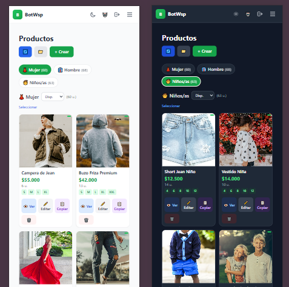
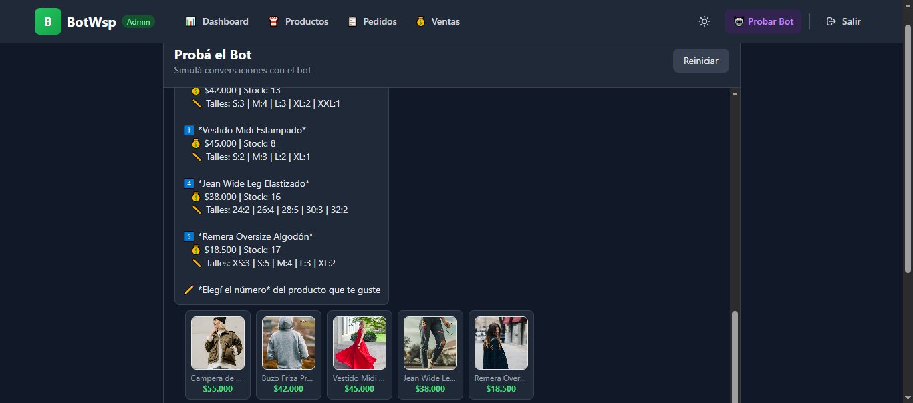
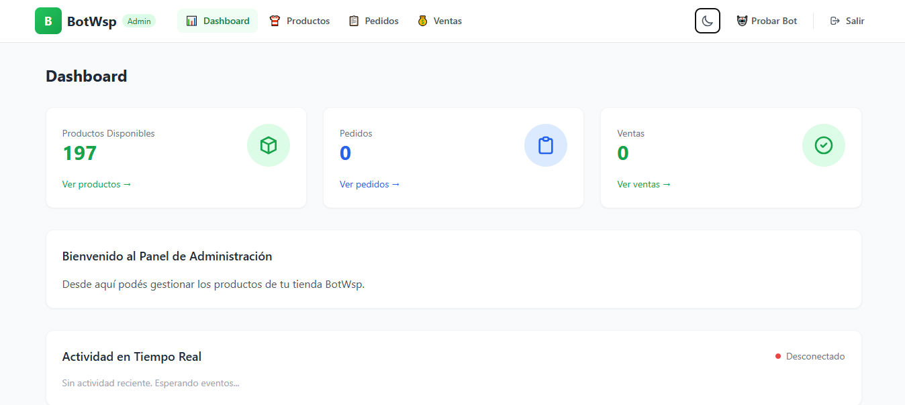
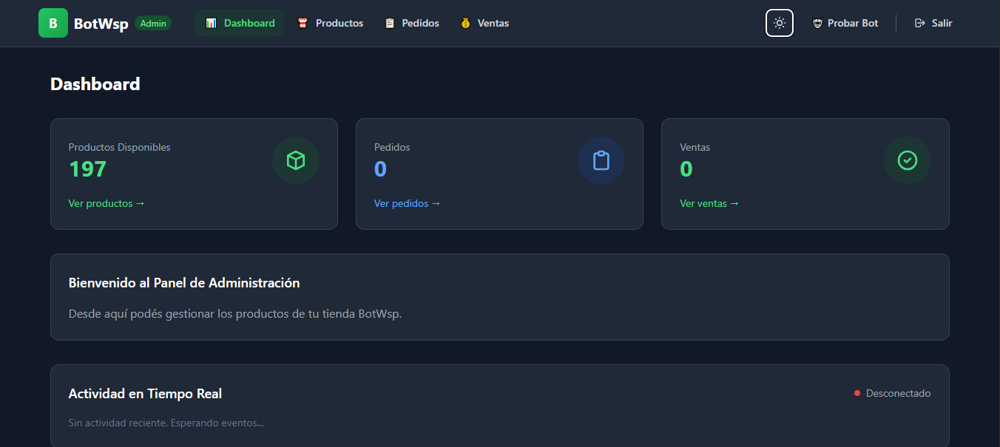
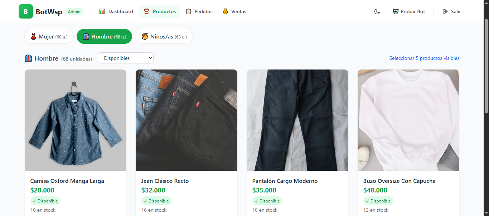
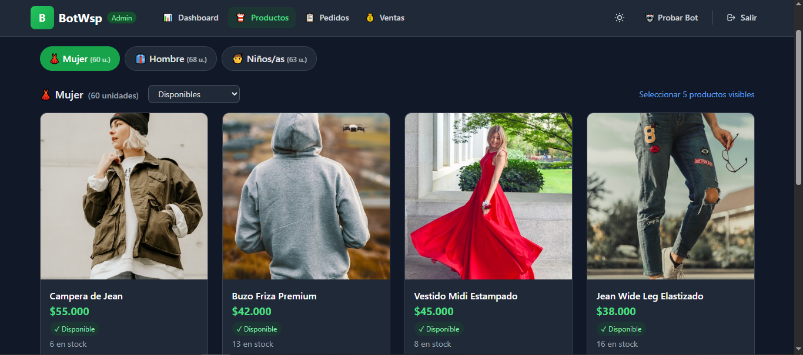
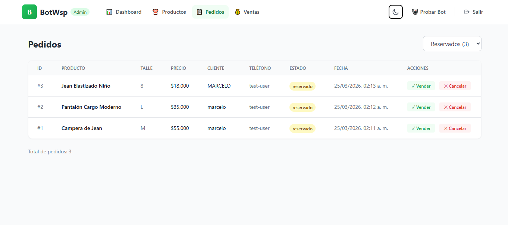
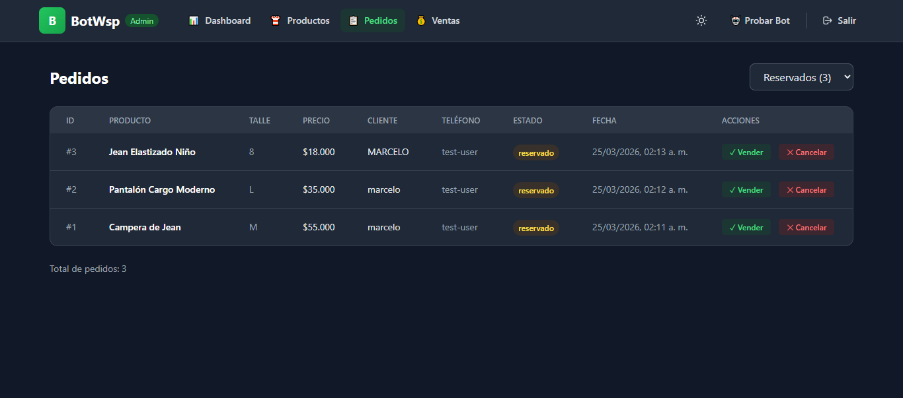
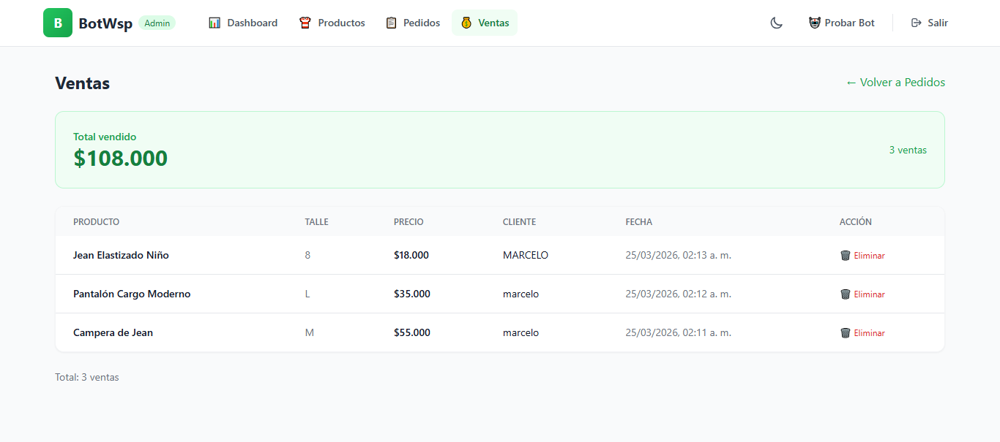
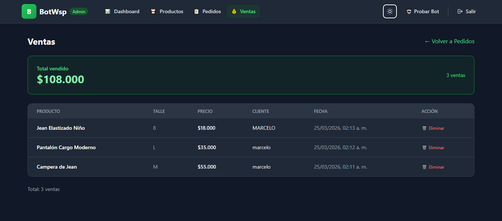

<div align="center">

# 🤖 BotWsp Store

<h1>
  
  WhatsApp Conversational Bot
</h1>

**Complete clothing store management system with automated bot + admin panel + REST API**

[](https://nodejs.org/)
[](https://whatsapp.com)
[](LICENSE)
[](https://javascript.com)

---

### 💬 Chat with the Bot

```
┌─────────────────────────────────────────────┐
│  🛍️  BotWsp Store                          │
│  ─────────────────                          │
│                                             │
│  👋 Hi! Welcome to BotWsp Store            │
│                                             │
│  What would you like to do?                 │
│                                             │
│  1️⃣  Browse Catalog                       │
│  2️⃣  View Promotions                      │
│  3️⃣  Payment Methods                       │
│  4️⃣  Shipping Information                 │
│  5️⃣  FAQ                                  │
│  0️⃣  Talk to the Owner                   │
└─────────────────────────────────────────────┘
```

</div>

## Screenshots

<details>
<summary><b>📱 Dashboard</b></summary>

</details>

<details>
<summary><b>💬 WhatsApp Bot</b></summary>

</details>

<details>
<summary><b>🖥️ Admin Panel - Light</b></summary>

</details>

<details>
<summary><b>🖥️ Admin Panel - Dark</b></summary>

</details>

<details>
<summary><b>📦 Products - Light</b></summary>

</details>

<details>
<summary><b>📦 Products - Dark</b></summary>

</details>

<details>
<summary><b>📋 Orders - Light</b></summary>

</details>

<details>
<summary><b>📋 Orders - Dark</b></summary>

</details>

<details>
<summary><b>💰 Sales - Light</b></summary>

</details>

<details>
<summary><b>💰 Sales - Dark</b></summary>

</details>

---

## Table of Contents

- [Description](#description)
- [Features](#features)
- [Screenshots](#screenshots)
- [Architecture](#architecture)
- [Requirements](#requirements)
- [Installation](#installation)
- [Configuration](#configuration)
- [Running](#running)
- [API Reference](#api-reference)
- [Admin Panel](#admin-panel)
- [Security](#security)
- [Database Structure](#database-structure)
- [License](#license)

---

## Description

BotWsp Store is a complete WhatsApp-based e-commerce solution for clothing stores. It combines an automated bot that interacts with customers, an API backend for data management, and a web admin panel for complete business control.

The system allows customers to browse the catalog, inquire about products, and reserve items directly from WhatsApp, while the administrator manages inventory, orders, and sales from a modern web interface.

---

## Features

### WhatsApp Bot
- **Interactive Catalog**: Browse by categories with products, prices, and sizes
- **Product Reservation**: Customers can reserve products by specifying size and contact info
- **Automated Queries**: FAQs, hours, payment methods, and shipping
- **Real-time Notifications**: Admin receives alerts for new reservations
- **Session Management**: Session persistence with Baileys

### Backend API
- **Complete REST API**: Endpoints for products, orders, categories, and customers
- **SQLite Database**: Lightweight and portable storage
- **JWT Authentication**: Secure tokens for the admin panel
- **Rate Limiting**: Protection against abuse
- **Image Upload**: Product photo management
- **Server-Sent Events (SSE)**: Real-time updates

### Admin Panel
- **Dashboard with Statistics**: Available products, pending orders, sales
- **Product Management**: Full CRUD with images and stock per size
- **Order Management**: View, confirm sales, cancel reservations
- **Sales History**: Complete transaction records
- **Real-time Updates**: Instant notifications via SSE
- **Responsive Design**: Works on desktop and mobile

---

## Architecture

```
┌─────────────────────────────────────────────────────────────────┐
│                         CLIENTS                                │
│                    (WhatsApp Messenger)                         │
└────────────────────────────┬────────────────────────────────────┘
                             │
                             ▼
┌─────────────────────────────────────────────────────────────────┐
│                          BOT (Baileys)                          │
│                    Port: configurable                          │
│  ┌─────────────┐  ┌─────────────┐  ┌─────────────────────────┐ │
│  │  Core       │  │  Flows      │  │  Handlers               │ │
│  │  (NLP)      │  │  (Logic)    │  │  (Test/Prod)            │ │
│  └─────────────┘  └─────────────┘  └─────────────────────────┘ │
└────────────────────────────┬────────────────────────────────────┘
                             │ HTTP/REST
                             ▼
┌─────────────────────────────────────────────────────────────────┐
│                     BACKEND (Express)                            │
│                       Port: 3001                              │
│  ┌─────────────┐  ┌─────────────┐  ┌─────────────────────────┐ │
│  │  Routes     │  │  Middleware │  │  Database (SQLite)      │ │
│  │  (API)      │  │  (Auth/CORS)│  │  (sql.js)               │ │
│  └─────────────┘  └─────────────┘  └─────────────────────────┘ │
└────────────────────────────┬────────────────────────────────────┘
                             │ HTTP/WebSocket
              ┌──────────────┴──────────────┐
              ▼                              ▼
┌─────────────────────────┐  ┌─────────────────────────────────────┐
│   ADMIN PANEL (Next.js)  │  │        BOT (Continuation)          │
│     Port: 3000          │  │    (Admin Notifications)            │
└─────────────────────────┘  └─────────────────────────────────────┘
```

---

## Requirements

- **Node.js**: Version 18.0 or higher
- **npm**: Version 8.0 or higher (included with Node.js)
- **Operating System**: Windows, macOS, or Linux

---

## Installation

### 0. Testing the app locally (optional)

To test the complete app with sample products:

```bash
# Terminal 1 - Backend
cd backend
npm install
npm run dev

# Terminal 2 - Load sample products
cd backend
node seed-products.js

# Terminal 3 - WhatsApp Bot
cd bot
npm install
npm run dev

# Terminal 4 - Admin Panel
cd admin-panel
npm install
npm run dev
```

**Access:**
- Admin Panel: http://localhost:3000 (admin / admin123)
- API: http://localhost:3001

The command `node seed-products.js` will create 15 sample products:
- 5 Women's products
- 5 Men's products
- 5 Kids' products

> **Note:** The bot requires scanning the QR code with your WhatsApp. Delete `bot/auth_info/` if you have connection issues.

### 1. Clone or download the project

```bash
git clone <repository-url>
cd bot-wsp-store
```

### 2. Directory Structure

```
bot-wsp-store/
├── bot/                    # WhatsApp Bot
├── backend/                # REST API
└── admin-panel/            # Admin Panel
```

### 3. Install dependencies

```bash
# Backend
cd backend
npm install

# Bot
cd ../bot
npm install

# Admin Panel
cd ../admin-panel
npm install
```

---

## Configuration

### Backend (.env)

Create `backend/.env` file based on `.env.example`:

```bash
cp backend/.env.example backend/.env
```

Available variables:

| Variable | Description | Default Value |
|----------|-------------|---------------|
| `PORT` | API server port | `3001` |
| `ADMIN_USER` | Admin panel username | `admin` |
| `ADMIN_PASSWORD` | Admin password | `admin123` |
| `JWT_SECRET` | JWT secret key | (auto-generated) |
| `ALLOWED_ORIGIN` | Allowed CORS origin | `http://localhost:3000` |

### Store (Business Configuration)

Edit `bot/config/tienda.js`:

```javascript
module.exports = {
  name: "Your Store",
  slogan: "Your slogan here",
  
  owner: {
    name: "Name",
    whatsapp: "+54 9 XXX-XXXXXXX"
  },
  
  location: {
    address: "Address",
    city: "City",
    province: "Province"
  },
  
  categories: {
    women: { /* women's categories */ },
    men: { /* men's categories */ },
    kids: { /* kids' categories */ }
  },
  
  // ... more settings
};
```

### Admin Panel

The panel uses Tailwind CSS and requires no additional configuration.

---

## Running

### 1. Backend

```bash
cd backend
npm run dev
```

The API server will be available at `http://localhost:3001`

### 2. WhatsApp Bot

```bash
cd bot
npm run dev
```

On startup, a QR code will be displayed in the terminal. Scan it with WhatsApp to connect.

**Available bot commands:**
- `hola` - Main menu
- `1` - View catalog
- `menu` - Return to main menu
- `reset` - Reset conversation

### 3. Admin Panel

```bash
cd admin-panel
npm run dev
```

Access at `http://localhost:3000`

---

## API Reference

### Authentication

#### POST /auth
Login to the admin panel.

```json
// Request
{
  "username": "admin",
  "password": "admin123"
}

// Response
{
  "success": true,
  "token": "eyJhbGciOiJIUzI1NiIs..."
}
```

#### POST /auth/verify
Verify JWT token validity.

```json
// Response
{
  "valid": true,
  "user": { "username": "admin" }
}
```

### Products

#### GET /products
List products with optional filters.

**Query parameters:**
- `status`: `disponible`, `reservado`, `vendido`, `all`
- `category`: Category ID

```json
// Response
[
  {
    "id": 1,
    "name": "Oversize T-Shirt",
    "price": 18000,
    "category": "women",
    "status": "available",
    "sizes": "S,M,L,XL",
    "stock": 15,
    "image_url": "/uploads/product-1.jpg"
  }
]
```

#### POST /products
Create new product (multipart/form-data).

| Field | Type | Description |
|-------|------|-------------|
| `name` | string | Product name |
| `price` | number | Price |
| `category` | string | Category ID |
| `description` | string | Description (optional) |
| `sizes` | string | Sizes separated by comma |
| `sizeStock` | JSON string | Stock per size |
| `image` | file | Product image |

#### PUT /products/:id
Update existing product.

#### DELETE /products/:id
Delete product.

#### POST /products/:id/reserve
Reserve product for a customer.

```json
{
  "customerName": "John Doe",
  "customerPhone": "+54 9 XXX-XXXXXXX",
  "size": "M"
}
```

#### POST /products/:id/sell
Mark reserved product as sold.

#### POST /products/:id/cancel-reserve
Cancel reservation and release product.

### Orders

#### GET /orders
List all orders.

#### POST /orders
Create new order.

#### PUT /orders/:id/status
Update order status.

**Valid statuses:** `reservado`, `vendido`, `cancelado`

#### DELETE /orders/:id
Delete order.

### Categories

#### GET /categories
List configured categories.

```json
[
  { "id": "women", "name": "Women", "icon": "👗" },
  { "id": "men", "name": "Men", "icon": "👔" }
]
```

#### POST /categories
Save/update categories.

### Real-Time (SSE)

#### GET /events
Server-Sent Events connection for real-time updates.

**Available events:**

| Event | Description |
|-------|-------------|
| `connected` | Connection established |
| `new_order` | New order created |
| `new_reservation` | Product reserved |
| `new_sale` | Sale completed |
| `product_update` | Product updated |

---

## Admin Panel

### Access Credentials

| Field | Value |
|-------|-------|
| URL | http://localhost:3000 |
| Username | `admin` |
| Password | `admin123` |

> ⚠️ Change credentials in production by editing `backend/.env`

### Features

#### Dashboard
- General statistics (products, orders, sales)
- Real-time notifications
- Recent system activity

#### Product Management
- Create products with image, price, description
- Assign category and available sizes
- Individual size stock control
- Statuses: available, reserved, sold
- Duplicate products
- Delete (individual or bulk)

#### Order Management
- View pending reservations
- Confirm sale
- Cancel reservation (releases product)
- View customer data

#### Sales History
- Complete record of confirmed sales
- Total sold
- Customer data and date

---

## Security

### Implemented Measures

| Feature | Description |
|---------|-------------|
| JWT Authentication | Tokens with 24h expiration |
| Rate Limiting | 100 req/15min general, 10 req/min for intensive routes |
| SQL Injection Protection | Parameterized queries |
| Input Sanitization | Validation and sanitization of all inputs |
| CORS Configurable | Only allowed origin configurable |
| Secure File Upload | Type validation (jpg/png/webp) and size (max 5MB) |
| HTTP Headers | Recommended security headers |

### Production Recommendations

1. **Change JWT_SECRET**: Generate a long random key
2. **Strong credentials**: Use complex passwords
3. **HTTPS**: Configure SSL/TLS
4. **Environment variables**: Never expose secrets in code
5. **Rate limiting**: Adjust based on expected traffic
6. **Database**: Consider migrating to PostgreSQL/MySQL for higher scale

---

## Database Structure

### Table: products

```sql
CREATE TABLE products (
  id INTEGER PRIMARY KEY AUTOINCREMENT,
  name TEXT NOT NULL,
  price REAL NOT NULL,
  description TEXT,
  category TEXT DEFAULT 'women',
  sizes TEXT,
  status TEXT DEFAULT 'available',
  image_url TEXT,
  reserved_by TEXT,
  reserved_at DATETIME,
  created_at DATETIME DEFAULT CURRENT_TIMESTAMP
);
```

### Table: product_sizes

```sql
CREATE TABLE product_sizes (
  id INTEGER PRIMARY KEY AUTOINCREMENT,
  product_id INTEGER NOT NULL,
  size TEXT NOT NULL,
  stock INTEGER DEFAULT 0,
  FOREIGN KEY (product_id) REFERENCES products(id)
);
```

### Table: orders

```sql
CREATE TABLE orders (
  id INTEGER PRIMARY KEY AUTOINCREMENT,
  product_id INTEGER NOT NULL,
  customer_name TEXT NOT NULL,
  customer_phone TEXT,
  size TEXT,
  status TEXT DEFAULT 'reserved',
  quantity INTEGER DEFAULT 1,
  created_at DATETIME DEFAULT CURRENT_TIMESTAMP,
  FOREIGN KEY (product_id) REFERENCES products(id)
);
```

### Table: customers

```sql
CREATE TABLE customers (
  id INTEGER PRIMARY KEY AUTOINCREMENT,
  name TEXT NOT NULL,
  phone TEXT,
  created_at DATETIME DEFAULT CURRENT_TIMESTAMP
);
```

---

## Business Flow

```
1. Customer sends "hola" to the bot
         │
         ▼
2. Bot responds with main menu
         │
         ▼
3. Customer selects "Browse Catalog" (option 1)
         │
         ▼
4. Customer chooses category (Women/Men/Kids)
         │
         ▼
5. Bot shows available products
         │
         ▼
6. Customer selects product
         │
         ▼
7. Customer chooses size
         │
         ▼
8. Customer enters name
         │
         ▼
9. ✅ Product is marked as RESERVED
         │
         ▼
10. Admin receives real-time notification
         │
         ├──► Confirm Sale → Product marked SOLD
         │
         └──► Cancel Reservation → Product back to AVAILABLE
```

---

## Troubleshooting

### QR code doesn't appear
- Verify the backend is running
- Check internet connection
- Delete `bot/auth_info/` and reconnect

### Panel doesn't connect to API
- Verify the backend is on the correct port
- Check CORS in `.env`
- Verify JWT token hasn't expired

### Products don't appear
- Sync from admin panel
- Verify product status (available/reserved/sold)
- Check assigned category

---

## Production

### Pre-configuration

1. **Change credentials** in `backend/.env`:
```env
ADMIN_USER=your-secure-username
ADMIN_PASSWORD=your-very-secure-password
JWT_SECRET=very-long-random-jwt-key-min-32-characters
ALLOWED_ORIGIN=https://your-domain.com
```

2. **Delete test data**:
```bash
rm -rf bot/auth_info/
rm backend/database/*.db
```

### Hosting Options

| Component | Recommended Options |
|------------|---------------------|
| Backend + Bot | Railway, Render, Fly.io, VPS (DigitalOcean/Linode) |
| Admin Panel | Vercel (recommended) or same VPS |

### Railway Deployment (example)

```bash
# 1. Upload code to GitHub
# 2. Create project in Railway
# 3. Connect repository
# 4. Configure environment variables in Railway
# 5. Automatic deployment
```

### Local Production with PM2

```bash
# Install PM2 globally
npm install -g pm2

# Backend
cd backend
pm2 start server.js --name botwsp-backend

# Build admin panel
cd ../admin-panel
npm run build
pm2 start npm --name botwsp-admin -- start

# Status
pm2 status

# Logs
pm2 logs
```

### Important Notes

- **WhatsApp**: The bot needs to maintain an active session. Doesn't work well on serverless hosting (Vercel).
- **SQLite**: For high traffic, consider migrating to PostgreSQL.
- **Images**: Currently stored locally. For production use Cloudinary or AWS S3.
- **Domain**: Configure SSL/HTTPS with Let's Encrypt or use hosting SSL.

---

## License

This project is under the MIT License. See [LICENSE](LICENSE) file for details.

---

## Contributing

1. Fork the repository
2. Create a branch (`git checkout -b feature/new-feature`)
3. Commit changes (`git commit -am 'Add new feature'`)
4. Push to the branch (`git push origin feature/new-feature`)
5. Create a Pull Request

---

## Support

To report bugs or request features, create an issue in the repository.
